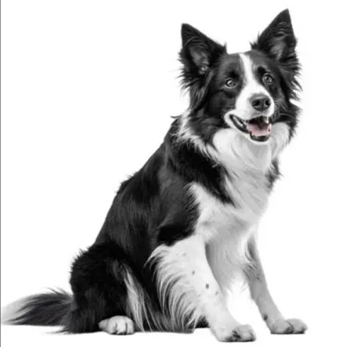
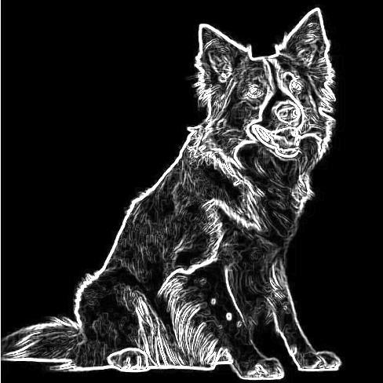

# Dadda-Multiplier-Based-Convolution-Engine-for-Sobel-Edge-Detection
Verilog implementation of a Dadda multiplier-based Sobel edge detection engine using 3×3 image convolution.

A hardware implementation of a **3×3 image convolution engine** using a **32-bit hierarchical Dadda Multiplier** to accelerate Sobel edge detection on grayscale images. The project is written entirely in **Verilog HDL** and demonstrates efficient convolution-based image processing suitable for FPGA implementation.


## Overview

Image convolution is one of the most computationally intensive operations in digital image processing and forms the core computation of many computer vision and deep learning applications. This project implements a dedicated convolution engine that performs a 3×3 Sobel filter using a custom-designed hierarchical Dadda multiplier architecture.

This implementation utilizes a Dadda multiplier to perform the nine multiplication operations required for each convolution window, followed by an adder chain to generate the final convolution result. The design demonstrates how optimized hardware arithmetic can improve the efficiency of convolution operations commonly used in edge detection and CNN convolution layers.


## Features

- Hierarchical 32-bit Dadda Multiplier
- Signed multiplication support
- 3×3 Convolution Engine
- Sobel X and Sobel Y Edge Detection
- Verilog HDL implementation
- FPGA-friendly architecture
- Fixed-point arithmetic
- Modular and reusable design

## Architecture

The convolution engine consists of:

- Nine parallel Dadda multipliers
- Eight-stage adder chain
- Signed convolution support
- 3×3 pixel window
- Configurable convolution kernel

```
Input Image
      │
      ▼
3×3 Pixel Window
      │
      ▼
9 Dadda Multipliers
      │
      ▼
Adder Chain
      │
      ▼
Convolution Output
      │
      ▼
Edge Detected Image
```

---

## Sobel Kernels

### Sobel X

```
-1   0   1
-2   0   2
-1   0   1
```

### Sobel Y

```
-1  -2  -1
 0   0   0
 1   2   1
```

---


## Working Principle

For every output pixel:

1. A 3×3 window is extracted from the input image.
2. Each pixel is multiplied by its corresponding Sobel kernel coefficient.
3. Nine multiplication results are summed using an adder chain.
4. The absolute value of the convolution result is computed.
5. Pixel values are clamped to the 8-bit grayscale range (0–255).
6. The resulting edge pixel is written to the output memory file.


## Experimental Results

The convolution engine was validated using grayscale images of different resolutions. The generated edge-detected images demonstrate the scalability of the proposed Dadda multiplier-based convolution engine without requiring changes to the hardware architecture.

## Experimental Results

### 32×32 Image

| Input Image | Edge Detected Output |
|-------------|----------------------|
|  |  |

### 64×64 Image

| Input Image | Edge Detected Output |
|-------------|----------------------|
|  |  |

### 490×490 Image

| Input Image | Edge Detected Output |
|-------------|----------------------|
|  |  |

> **Note:** The output image dimensions are reduced by two pixels in both width and height because the convolution engine performs a **3×3 valid convolution** (no zero-padding), resulting in output sizes of **30×30**, **62×62**, and **488×488** for input images of **32×32**, **64×64**, and **490×490**, respectively.
## Technologies Used

- Verilog HDL
- FPGA Design
- Vivado
- Digital Image Processing
- Dadda Multiplier Architecture

---

## Applications

- Edge Detection
- Image Processing
- Computer Vision
- Embedded Vision Systems
- FPGA Accelerators
- CNN Convolution Hardware

---

## Future Improvements

- Parameterized image size
- Parameterized kernel size
- Streaming image interface
- AXI interface
- Pipeline optimization
- SIMD support
- Integration with a RISC-V processor
- CNN accelerator framework

